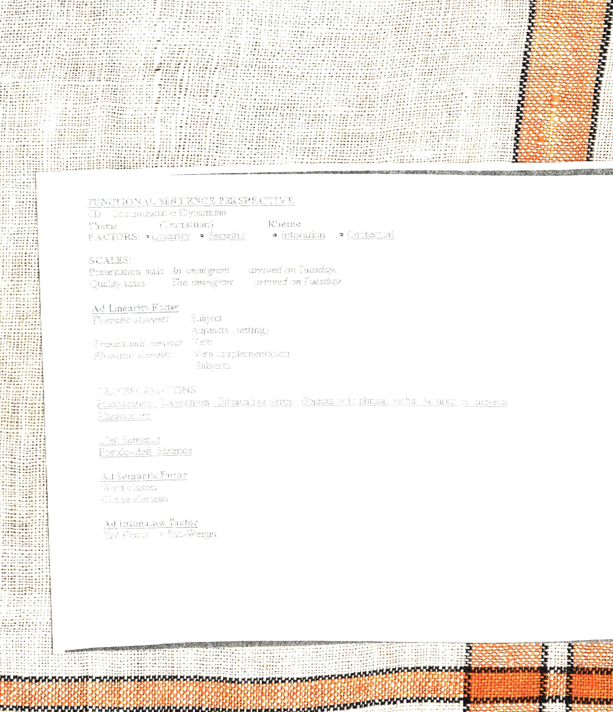

Syntax II
===================

Functional sentence perspective:Theme , Rheme
--------------------------
PLC:

Jan Firbas:

 - Theme->Transition-> Rheme
 - Comunacative dynamicism. (CD) - every element in a sentence pushes comunication forward. The extent to which the element pushes comunication forward is CD.  Some elements(At the begining) have a low CD, and as we near the end, the elements have progressively higher CD.
 - This is the scale of rising CD.

This scale of CD coresponds to the typical arragement of what may be called objective order.  I've been stressing one thing, the comunacative significance.  And been ignoring, for example, the gramatical element.

4 factors affect CD:
---------------
 - Linearity:
   farther left, higher CD
 - Semantic:
   Elements have predisposition to a given CD.  Ex: An indefinite article in English is predisposed to convey something new.  Definite article is predisposed to convey something familiar.  Subjects are predisposed to familiarity(low CD)
 - Intonational: Whatever carries stress is significant(High CD).  Prosodically dense words/phrases(words/phrases which contain more sylables) come near the end.
 Second order sentences: Repetitions.  When the listener doesn't understand a sentence, the speaker may repeate the sentence, with the previously missunderstood element stressed.
 - Contextual: Linguistic and extra linguistic(situational)

Scales
------
 - Presentation scale: (Ex. An immigrant --- arrived on Tuesday.) If we introduce new things in our sentence, we use presentation scales.  Only 15% of sentences introduce  new info and use presentation scales.
 - Quality scale: (Ex. The imigrant --- arived on Tuesday) The majority of cases. These sentences follow the origional FSP model of higher CD elements coming at the end.  The Presentation Scale sentences are unsual in that the subject is new as well(not yet familiar to the listener) and thus the elements of the sentence may have similar CD with no increase in CD near the end.

Rhematizers:(attention drawing words) Only, especialy, even, particularly.

Page 57 analysis

1. inversion, presentation scale

8.  

