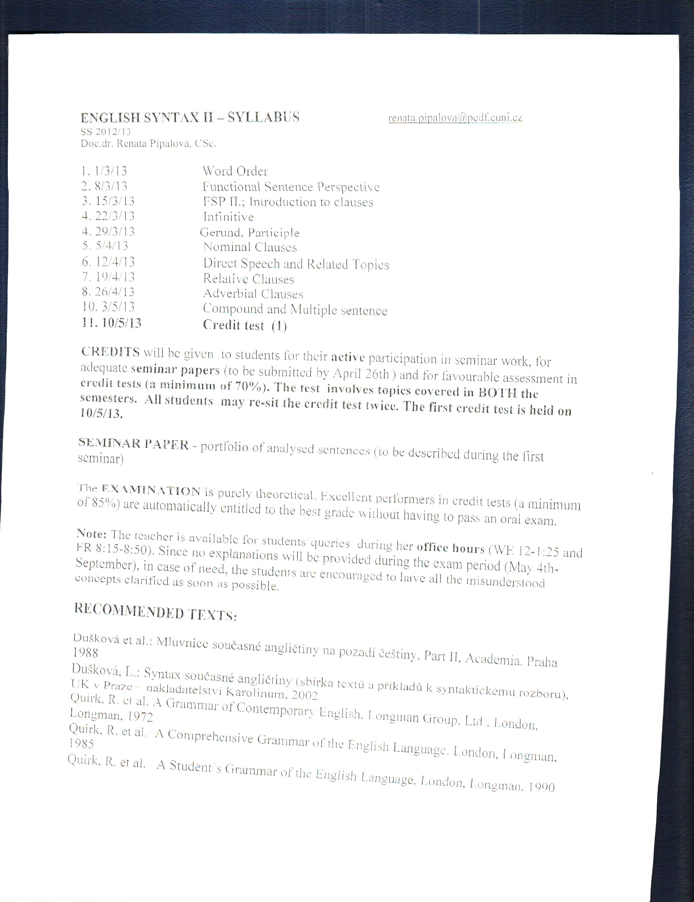
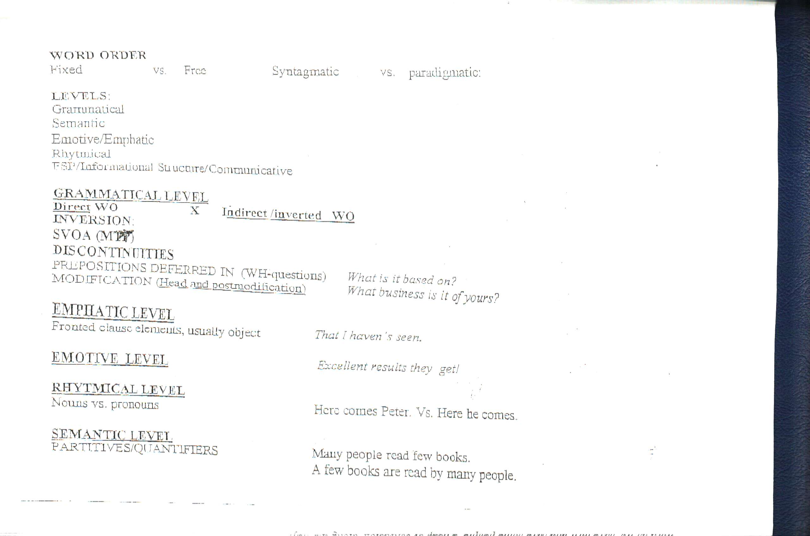
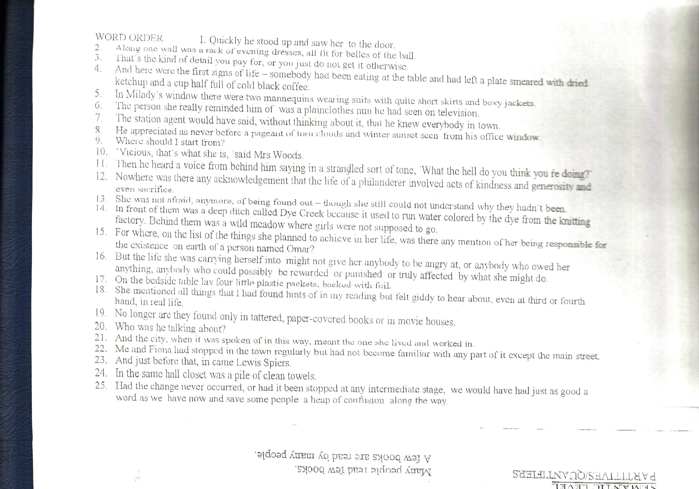

Syntax II
====================

Portfolio:
-----------

- printed form
- what it is, reasons

- disconituity(3 different examples)
- fronting
- inversion

Obsah:
--------------

- Complex sentences
- compound sentences
- multiple sentences

Notes
=========

- syntagmatic - sequencing
- paradigmatic - contrast

levels of word order
----------------

- gramatical
- semantic - changing position changes meaning
- emotive/emphatic what is known, or new changes with word order
rhythmical

indirect word order vs inverted word order
--------------

- indirect - interogative
- direct - declarative

changing word order changes sentence type

3rd conditionals - had I known that, I wouldn't have come.

inverted word order:
================
- sva paterns have inverted word order
  "Out went the bus" (transitive verb)
- start with a negative element.
  "Not a word did they say."

order of adjuncts : maner, place, time

sequencing objects when there is more than one in the sentence. Indirect, direct, prepositional.
  "I gave her an apple."
  "I gave an apple to her."

Discontinuity.
==============

[Porušení principu členské sounáležitosti](http://emsa.ff.cuni.cz/14.13)

discontinuity. seperation of two related clause elements.
-  Defered preposition: "What is it based [on]."(Normally prepositions precede nouns, here it precedes nothing but it is a case of discontinuity, it is seperated from it's counterpart "what").
  "What he aspires to is beyond his reach."
-  defered modifiers: "The question arises, whether to continue." (The attribute is positioned finally, discontinued from the head it modifies.) Without discontinuity this would be "The question whether to continue arises."

- Emphasis. Word order also operates on the emphatic level.  "That I have seen" rather than saying "I haven't seen that.".  Moving that to the very beginning. (How do you front a subject, when it's normally in the very begining?)
emotional fronting: "Excelent results, they get." Creates a negative, an irony, a "reversed polarization."

Rythmic word order:
-------------
The lesser sylabus procedes the heavyer counterparts.

Semantic word order:
-------------
"Many people read few books." "Many books are read books are read by few people."

Adverbs may belong to multiple classes
-------------------
"Clearly" - disjunct "Clearly, they understood.", maner adjunct "They understood clearly."

examples in handout
=============================

1. Direct word order. Declarative sentence.  (Emphasis of adjunct of maner, fronting)
2. inversion. (copular, intransative verbs. inversion is typical)
3. "for" is a defered preposition, discontinuity. 
5. fronting of a adverbial of space. Direct word order.
6. direct word order, declarative sentence
7. discontinuity, verb and object displaced by adjunct of maner(acompanying circumstances)
8. 
9. discontinuity 
10. 
11. First clause: direct word order. Seccond clause: Inverted word order(interogative sentence). "the hell" causes discontinuity.
12. inversion(due to negative element)
13. 
17. inversion due to an intransitive verb and fronting of the adjunct of space.
