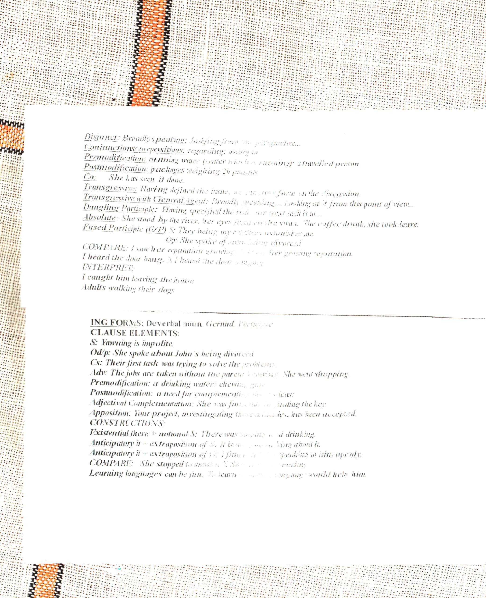

Syntax II

Difference between gerund and participle.  Gerund is more nominal.  Gerund typically takes syntactic functions that are normally taken by syntactic nouns.

Difference between gerund subject and infinitive subject.  Gerund subject is more common.  Gerund subject is more general: "Teaching syntax is fun." vs "To teach this group syntax is fun."

Gerund can take the object function "She enjoys playing the guitar." Gerund as subject compliment  "Their first task was trying to solve the problems."

Premodification realised by the gerund: "Chewing gum"(gum for chewing).

Post modification realised by gerunds.  "Dissapointment at hearing something."

"She was fortunate in finding the key." SVC pattern.  "at finding the key." <- adjectival complementation.

Gerund apposition: "Your project,  investigating these attitudes, has been accepted."

Exticential construction, followed by a real subject expressed by a gerund. "There was singing and drinking."

Participles differ from Gerunds in that they are primarrily adjectival and verbal.  They refer to qualities and actions.
Participle as disjunct: " Rudely speaking."
Prepositions
Participle: "Running water." (water that is running.) vs gerund: "chewing gum"(gum for chewing) 

Transgressives(přechodník)
Realised exclusively by participles. Ideal example of sentence shortening.  "Having defined the issue, we can now focus on the discussion." Transgressive: "Having defined the issue", no subject expressed, infered from the clause that follows.  Possition of the transgressive is irrelevant.

Trangressive with a general agent: "Broadly speaking" <- prefabricated phrases.
Syntactically indistinguishable from the dangling participle: Having specified the risk, our next task is to..."  The difference between general agent transgressives and dangling participles is that the general agent ones are set phrases.

Absolute participle: By deffinition a non finite verb form should not feature it's subject.  But the absolute participle DOES: "She stood by the river, her eys fixed on the swamp."  "her eyes fixed on the swamp." "fixed" is a post participle, but it is preceded by a subject.   "The coffee drunk, she took leave." "The coffe drunk" is a particple. 

Fused participle: "They being my relatives astonishes me." Takes the nominal function, thus sugesting that it is a gerund.  However, a regular gerund takes as a premodifier the possesive pronound, proper gerund would be written as "their being my relatives", thus this example resembles a participle.  It seems to be somewhere between a participle and a gerund.

