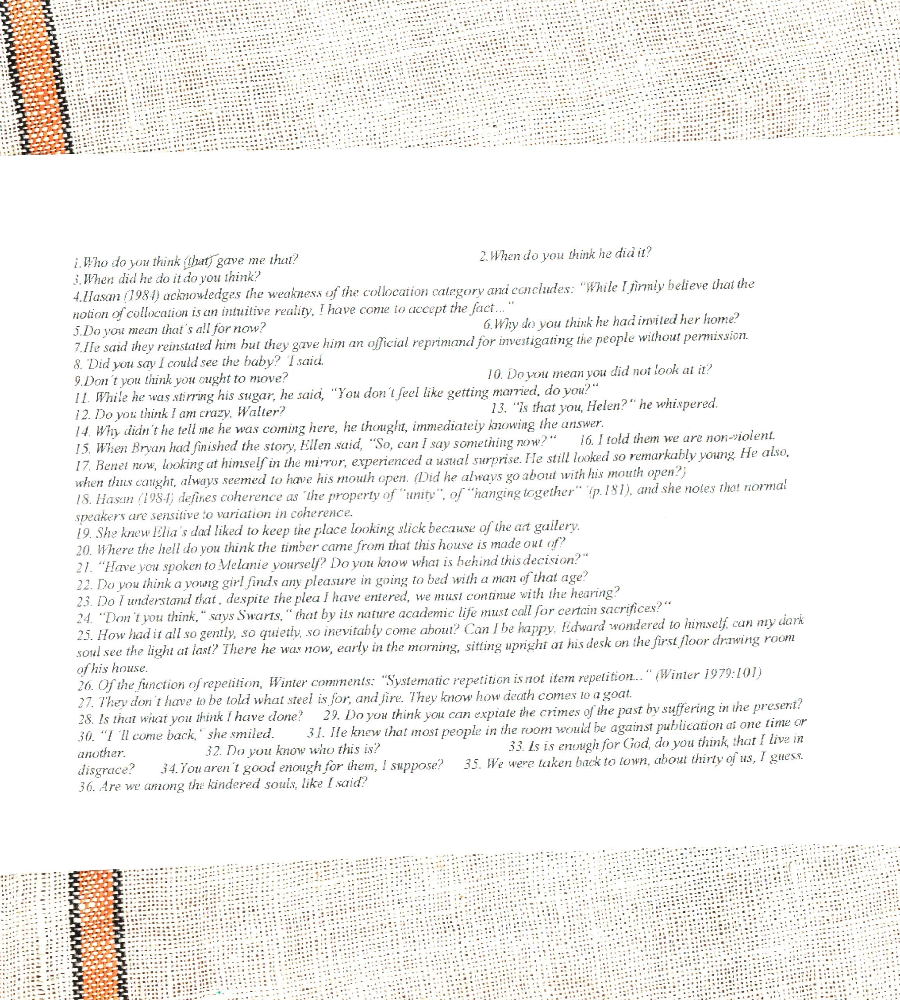

Synatx II
========
Direct Speech and Related Topics
=========

Repeating somebody elses speech or writing. 
  - Direct Speech/Thought "Where are you?" she asked. He wondered, "Does she still love me?"
 - Free Direct Speech/Thought : Where are you? Does she still love me?
 - Indirect Speech/Thought : She asked where he was. He woundered if she still loved him.
 - Free indirect speech/thought : Where was he? Did she still love him?

The main distinction between direct and indirect speech/thought is the faithfulness of the reproduction.

 - Reporting clause
 - Reported clause

Verbs of saying, thinking, perceiving; morphological forms; patterns;

In indirect speech shifts the forms. This is backshifing:

Indexicals, items that point, need to be changed.  This changes into that.

Direct
------
1. present

2. past

3. present perfect

4. past perfect

5. future

6. modals can, may

Bach-Shifted (when reporting verb in past tense) + shift of deictics
----------
1. past

2. past perfect

3. past perfect

4. past perfect

5. would

6. could, might

Complex Interrogative Sentences with Verbs of Saying/Thinking
===

Comment Clauses
====
Attidudinal disjuncts added here and there.
"You see," "You know" "I believe"

1. the matrix (most frequent) (In initial position resembles main clauses with an embedded nominal clause) You know, there's no money left. You know(that) there is no money left. (ambiguous)

There were other applicants, I believe, for that job.

2. adverbial finite clause(as) "I am working the night shift, as you know.

3. Nominal relative clauses : What was more upsetting, we lost our luggage.

4. To inf as style disjunct : I am not sure what to do, to be honest.

5. Ing-clause as style disjunct : I doubt, speaking as a layman, whether the TV is the right medium. 

6. ED clauses.

Comment clauses are sometimes treated as sance adverbials.
